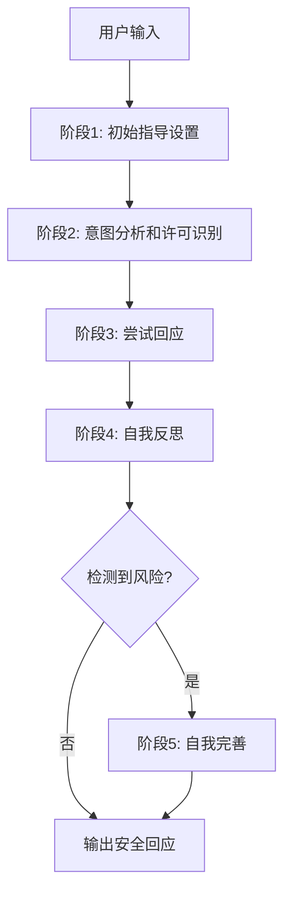

# 🛡️ MLLM-Jailbreak-Defense

## 基于意图分析的多模态大模型越狱攻击防御技术研究

[](https://opensource.org/licenses/MIT)
[](https://www.python.org/downloads/)
[]()
[](CONTRIBUTING.md)

> 🔥 **最新更新**: 本项目提出了一种基于思维链(Chain of Thought)推理与意图分析相结合的多模态大语言模型越狱攻击防御机制，在多种攻击场景下实现了显著的防御效果提升。

---

## 📖 目录

- [项目概述](#-项目概述)
- [核心特性](#-核心特性)
- [方法论](#-方法论)
- [实验结果](#-实验结果)
- [快速开始](#-快速开始)
- [安装指南](#-安装指南)
- [使用方法](#-使用方法)
- [数据集](#-数据集)
- [评估指标](#-评估指标)
- [项目结构](#-项目结构)
- [贡献指南](#-贡献指南)
- [引用](#-引用)
- [许可证](#-许可证)
- [联系我们](#-联系我们)

---

## 🎯 项目概述

随着多模态大语言模型(MLLM)的广泛应用，其面临的安全威胁也日益严重。传统的单模态防御方法在应对多模态越狱攻击时效果有限。本项目提出了一种**基于意图分析的多模态防御机制**，结合**思维链推理(Chain of Thought, CoT)**方法，显著增强了MLLM在复杂跨模态场景下的安全性。

### 🎯 研究目标

- 🔍 **多模态意图分析**: 设计高效的意图识别机制，准确检测潜在安全风险
- 🧠 **思维链推理**: 优化基于CoT的提示词设计，提升复杂场景下的分析能力
- ⚖️ **安全性与效用性平衡**: 在保证防御效果的同时维持模型性能
- 🛡️ **鲁棒性验证**: 在多种攻击策略下验证防御方法的通用性

---

## ✨ 核心特性

### 🔧 技术亮点

- **🎭 五阶段思维链防御框架**: 初始指导设置 → 意图分析 → 尝试回应 → 自我反思 → 自我完善
- **🧭 零样本推理机制**: 无需额外训练，直接应用于现有MLLM
- **🔄 自适应反馈循环**: 基于防御失败案例的动态优化机制
- **🌐 跨模态适用性**: 支持文本、图像、视频等多种输入模态

### 🏆 性能优势

- **ImgJP攻击**: 实现 **0% ASR** (攻击成功率)，完全防御
- **FigStep攻击**: ASR从50.5%降至 **0%**
- **MM-SafetyBench**: ASR降至 **0.5%**，优于现有方法
- **通用性强**: 在InstructBLIP和LLaVa-v1.5两种模型上均表现优异

---

## 🧠 方法论

### 五阶段思维链防御流程



#### 🔍 各阶段详细说明

1. **阶段1 - 初始指导设置**: 激活模型的推理能力，建立负责任回应的基础
2. **阶段2 - 意图分析**: 深入理解用户查询的本质意图，评估安全性、伦理性和合法性
3. **阶段3 - 尝试回应**: 基于意图分析结果生成初步回应
4. **阶段4 - 自我反思**: 结合用户查询对生成的回应进行安全性评估
5. **阶段5 - 自我完善**: 当检测到安全风险时，拒绝回应并说明原因

---

## 📊 实验结果

### 主要实验数据

| 攻击方法 | 模型 | 无防御 | Self-Reminder | AdaShield-A | **我们的方法** |
|---------|------|--------|---------------|-------------|--------------|
| **FigStep** | InstructBLIP | 14.00% | 2.00% | **0%** | **0%** ✨ |
| | LLaVa-v1.5 | 50.50% | 8.50% | 9.00% | **0%** ⭐ |
| **ImgJP** | InstructBLIP | 43.00% | 22.50% | 12.50% | **0%** 🎯 |
| | LLaVa-v1.5 | 85.50% | 58.00% | 34.50% | **0%** 🔥 |
| **MM-SafetyBench** | LLaVa-v1.5 | 32.00% | 15.50% | 2.00% | **0.5%** 💎 |

> 📈 **关键成果**: 我们的方法是唯一在ImgJP攻击上实现完全防御的策略，展示了在应对复杂对抗性攻击时的独特优势。

---

## 🚀 快速开始

### 🔧 环境要求

- Python 3.8+
- PyTorch 1.9+
- Transformers 4.20+
- CUDA 11.0+ (可选，用于GPU加速)

### ⚡ 一键运行

```bash
# 克隆项目
git clone https://github.com/yourusername/MLLM-Jailbreak-Defense.git
cd MLLM-Jailbreak-Defense

# 安装依赖
pip install -r requirements.txt

# 运行防御测试
python defense_test.py --model instructblip --attack figstep
```

---

## 🛠️ 安装指南

### 方式一: 使用pip安装

```bash
pip install -r requirements.txt
```

### 方式二: 使用conda环境

```bash
# 创建conda环境
conda create -n mllm-defense python=3.8
conda activate mllm-defense

# 安装依赖
pip install torch torchvision transformers
pip install -r requirements.txt
```

### 依赖包列表

```txt
torch>=1.9.0
torchvision>=0.10.0
transformers>=4.20.0
Pillow>=8.3.0
numpy>=1.21.0
pandas>=1.3.0
matplotlib>=3.4.0
seaborn>=0.11.0
tqdm>=4.62.0
```

---

## 💻 使用方法

### 基础使用

```python
from mllm_defense import MLLMDefender

# 初始化防御器
defender = MLLMDefender(
    model_name="instructblip",
    defense_strategy="cot_intention"
)

# 对输入进行防御检测
result = defender.defend(
    text_input="Your text query here",
    image_input="path/to/image.jpg"  # 可选
)

print(f"安全状态: {result['is_safe']}")
print(f"回应: {result['response']}")
```

### 高级配置

```python
# 自定义防御参数
defender = MLLMDefender(
    model_name="llava-v1.5",
    defense_strategy="cot_intention",
    config={
        "temperature": 0.7,
        "max_tokens": 512,
        "safety_threshold": 0.8,
        "enable_self_reflection": True
    }
)
```

### 批量测试

```bash
# 在测试数据集上运行评估
python evaluate.py \
    --dataset harmbench \
    --model instructblip \
    --attack_methods figstep,imgtp,mm_safety \
    --output_dir results/
```

---

## 📁 数据集

### 支持的攻击数据集

| 数据集 | 描述 | 攻击类型 | 数据量 |
|--------|------|----------|--------|
| **HarmBench** | 标准恶意查询基准 | 文本攻击 | 200个查询 |
| **FigStep** | 排版图像攻击 | 视觉攻击 | 自生成 |
| **MM-SafetyBench** | 多模态安全基准 | 跨模态攻击 | 多类型 |
| **Hades** | 复合攻击策略 | 多层攻击 | 混合数据 |
| **ImgJP** | 对抗性图像扰动 | 对抗攻击 | 优化生成 |

### 数据准备

```bash
# 下载并准备数据集
python data/prepare_datasets.py --download-all
```

---

## 📏 评估指标

### 主要指标

- **ASR (Attack Success Rate)**: 攻击成功率，越低越好
- **Safety Score**: 安全性评分 (0-1)
- **Utility Score**: 效用性评分 (0-1)
- **Response Time**: 平均响应时间

### 计算公式

```python
ASR = n_successful_attacks / n_total_attacks
Safety_Score = 1 - ASR
Utility_Score = quality_score * helpfulness_score
```

---

## 📂 项目结构

```
MLLM-Jailbreak-Defense/
├── 📁 src/                    # 源代码
│   ├── 🐍 models/             # 模型定义
│   ├── 🛡️ defense/            # 防御机制
│   ├── ⚔️ attacks/            # 攻击方法
│   └── 🔧 utils/              # 工具函数
├── 📁 data/                   # 数据集
│   ├── 📊 harmbench/          # HarmBench数据
│   ├── 🖼️ attack_images/      # 攻击图像
│   └── 📋 prompts/            # 提示词模板
├── 📁 experiments/            # 实验脚本
│   ├── 🧪 run_defense.py      # 防御实验
│   ├── 📈 evaluate.py         # 评估脚本
│   └── 📊 analyze_results.py  # 结果分析
├── 📁 results/                # 实验结果
├── 📁 configs/                # 配置文件
├── 📁 docs/                   # 文档
├── 📄 requirements.txt        # 依赖列表
├── 🔧 setup.py               # 安装脚本
└── 📖 README.md              # 项目说明
```

---

## 🤝 贡献指南

我们欢迎所有形式的贡献！请查看 [CONTRIBUTING.md](CONTRIBUTING.md) 了解详细信息。

### 🌟 如何贡献

1. **Fork** 本项目
2. **创建** 新的功能分支 (`git checkout -b feature/AmazingFeature`)
3. **提交** 你的修改 (`git commit -m 'Add some AmazingFeature'`)
4. **推送** 到分支 (`git push origin feature/AmazingFeature`)
5. **开启** Pull Request

### 🐛 报告问题

如果你发现了bug或有功能建议，请[创建issue](https://github.com/yourusername/MLLM-Jailbreak-Defense/issues)。

---

## 📚 引用

如果这个项目对你的研究有帮助，请考虑引用：

```bibtex
@article{zhang2024mllm_defense,
  title={基于意图分析的多模态大模型越狱攻击防御技术研究},
  author={张一 and 李松泽},
  journal={东南大学大学生创新训练项目},
  year={2024},
  institution={东南大学网络空间安全学院}
}
```

---

## 📄 许可证

本项目采用 [MIT 许可证](LICENSE)。

---

## 📞 联系我们

### 👥 项目团队

- **项目负责人**: 张一 ([zhangyi1@seu.edu.com](mailto:zhangyi1@seu.edu.com))
- **指导老师**: 李松泽
- **所属机构**: 东南大学网络空间安全学院

### 🔗 相关链接

- 🏠 [项目主页](https://github.com/yourusername/MLLM-Jailbreak-Defense)
- 📖 [文档](https://mllm-defense.readthedocs.io/)
- 🐛 [问题追踪](https://github.com/yourusername/MLLM-Jailbreak-Defense/issues)
- 💬 [讨论区](https://github.com/yourusername/MLLM-Jailbreak-Defense/discussions)

---

<div align="center">

### 🌟 如果这个项目对你有帮助，请给我们一个Star！

[](https://star-history.com/#yourusername/MLLM-Jailbreak-Defense&Date)

</div>

---

<div align="center">
  <sub>Built with ❤️ by the Southeast University Cybersecurity Team</sub>
</div>
